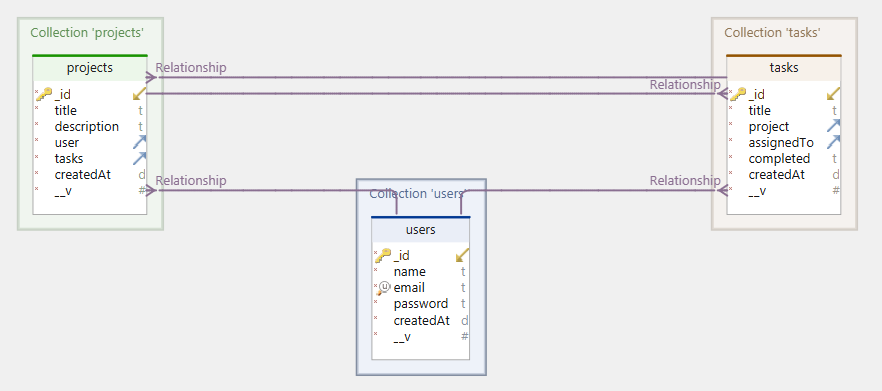

<h1 align="center">API ToDoList</h1>

API de projetos e tarefas

  <a href="#-tecnologias">Tecnologias</a>&nbsp;&nbsp;&nbsp;|&nbsp;&nbsp;&nbsp;
  <a href="#-projeto">Projeto</a>&nbsp;&nbsp;&nbsp;|&nbsp;&nbsp;&nbsp;

 

  

## 🚀 Tecnologias

Esse projeto foi desenvolvido com as seguintes tecnologias:

- NodeJS
- JavaScript
- Express
- MongoDB
- Mongoose
- Bcrypt
- Nodemailer
- JWT

##

## 💻 Projeto

- Projeto de estudos voltado a praticar e aprender novas tecnologias